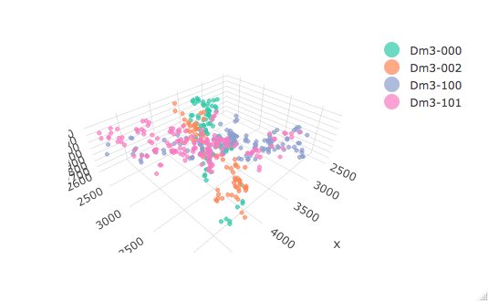
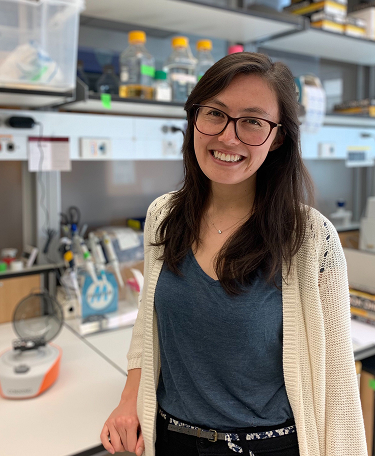

# About Yen

.pull-left[
## Yen-Chung Chen
- 5th-year PhD student in the Desplan lab
- Work with 🪰, `r fontawesome::fa(name = "r-project", fill = "#57068c")`, and 
  `r fontawesome::fa(name = "python", fill = "#57068c")`.
]

--

.pull-right[
```{r, echo=FALSE, out.width="75%"}

knitr::include_graphics("img/L3_optic_lobe.png")
```
]

---

# About Cassandra

.pull-left[
## Cassandra Buzby
- 5th-year PhD student in the Siegal lab
- Study yeast and R
  - How much do gene interactions contribute to phenotypic variation?
]

.pull-right[
```{r, echo = FALSE, out.width = "75%"}

```
]

---
layout: true
# Why are we here?

.pull-left[
## Because
- Biology has become big
- We need multiple perspectives
- We need to challenge our premise
]

---

.pull-right[

`r knitr::include_graphics("img/scrna.png")`

]

.legend[
[1] [Angerer _et al._ (2017)](https://doi.org/10.1016/j.coisb.2017.07.004)
]

---

.pull-right[

`r knitr::include_graphics("img/gb.png")`

]
.legend[
[1] [GenBank and WGS Statistics](https://www.ncbi.nlm.nih.gov/genbank/statistics/)
]

---
.pull-right[
## Therefore
- Data wrangling (3)
- Data visualization (2)
- Statistics and modeling (2)
]
---
layout: true
# Do (not) bother to pick a language

---

- Languages are often more similar than different

--

```r
# R
model <- lm(x = data[["x"]], y = data[["y"]])
```
--

```python
# Python
model = LinearRegression()
model.fit(x = data['x'], y = data['y'])
```
--

```julia
# julia
model = lm(@formula(y~x), data)
```

--

```octave
# MATLAB
model = fitlm(data, 'y', 'x');
```

---

- Use whatever tool your peers are using

--

- Use what is popular in your field

--

- Use what addresses your immediate need

---
layout:true
# Why R?
---

.pull-left[
## Pros

- R is intuitive
- R has a strong community in genomics and statistics
- R is very visual
]

--

.pull-right[
## Cons

- R could be counterintuitive in a programming sense
- R is less powerful for building computationally heavy tools
]

---
layout: false

# Goals of this workshop


- Help you to do whatever you want to do with your data in R

--

- Give you the lever to work with thousands to millions of data entries (`dplyr` and `tidyr`)
  
--

- Visualize your data in multiple perspectives with minimal struggle (`ggplot2`)
  
--

- Test your hypotheses with statistics

---
class: inverse, middle, center, section-title

# Questions?
