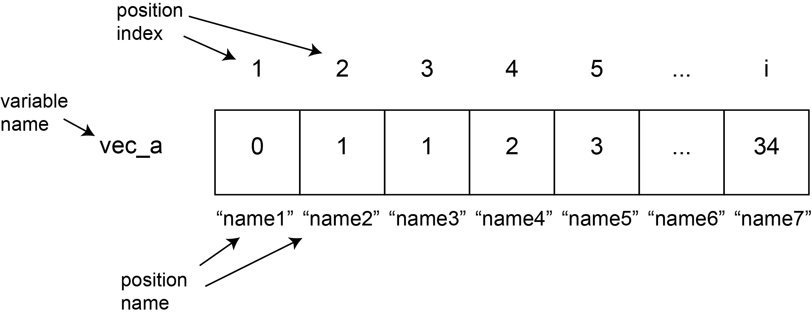

Workshop 4 Presentation
========================================================
author: Cassandra Buzby & Yen-Chung Chen
date: 2021-07-06
autosize: true

Review
========================================================
incremental: true
Defining Vectors

- Using c() for combine


```r
c(1,2,3,4,5)
```

```
[1] 1 2 3 4 5
```

- Defining vector variables

```r
myvector <- c(1:20)
myvector
```

```
 [1]  1  2  3  4  5  6  7  8  9 10 11 12 13 14 15 16 17 18 19 20
```

Review Exercises
========================================================
incremental: true
Vector Math

- How would you check the length of a vector?


```r
myvector
```

```
 [1]  1  2  3  4  5  6  7  8  9 10 11 12 13 14 15 16 17 18 19 20
```

```r
length(myvector)
```

```
[1] 20
```
- Why is this important?

 *** 

Can you add 5 to every value of myvector? Can you multiply those two vectors together?

```r
vectorplus5 <- myvector + 5
vectorplus5
```

```
 [1]  6  7  8  9 10 11 12 13 14 15 16 17 18 19 20 21 22 23 24 25
```

```r
vectorplus5 * myvector
```

```
 [1]   6  14  24  36  50  66  84 104 126 150 176 204 234 266 300 336 374 414 456
[20] 500
```

Review: vectors, functions, and types
========================================================
## Vectors and functions

```r
# Create a variable, vect_1 that holds a vector containing any 4 numbers

# Calculate the sum of vect_1 and print it out on the screen

# Create a new variable, vect_2, that contains each value of vect_1 squared
# (Don't manually enter the numbers, use vect_1 to calculate this)
```


Review: vectors, functions, and types
========================================================
## Vectors and functions

```r
# Create a variable, vect_1 that holds a vector containing any 4 numbers

# Calculate the sum of vect_1 and print it out on the screen

# Create a new variable, vect_2, that contains each value of vect_1 squared
# (Don't manually enter the numbers, use vect_1 to calculate this)
```


```r
vect_1 <- c(23,5,47,12)
vect_1
```

```
[1] 23  5 47 12
```

Review: vectors, functions, and types
========================================================
## Vectors and functions

```r
# Create a variable, vect_1 that holds a vector containing any 4 numbers

# Calculate the sum of vect_1 and print it out on the screen

# Create a new variable, vect_2, that contains each value of vect_1 squared
# (Don't manually enter the numbers, use vect_1 to calculate this)
```


```r
sum(vect_1)
```

```
[1] 87
```

Review: vectors, functions, and types
========================================================
## Vectors and functions

```r
# Create a variable, vect_1 that holds a vector containing any 4 numbers

# Calculate the sum of vect_1 and print it out on the screen

# Create a new variable, vect_2, that contains each value of vect_1 squared
# (Don't manually enter the numbers, use vect_1 to calculate this)
```


```r
vect_2 <- vect_1^2
vect_2
```

```
[1]  529   25 2209  144
```

Sequences of numbers
========================================================
incremental: true
- What function can we use to make a vector of evenly spaced elements?


```r
# Create a vector of numbers from -5 to 5 containing 21 elements called review_vec
```


```r
review_vec <- seq(-5,5,length.out = 21)
review_vec
```

```
 [1] -5.0 -4.5 -4.0 -3.5 -3.0 -2.5 -2.0 -1.5 -1.0 -0.5  0.0  0.5  1.0  1.5  2.0
[16]  2.5  3.0  3.5  4.0  4.5  5.0
```


Getting specific elements from vectors
========================================================
Often, it's really useful to find out what the value of a specific position (or *index*) in a vector is. R makes this easy.



Getting specific elements from vectors
=======================================================
Let's create a really long vector and ask R to tell us about specific points along that vector.

```r
# Create three variables, first_num, last_num, and num_of_elements
# The first two can be whatever numbers you want, num_of_elements should be 100
# DON'T use 1 for first_num, and don't use 100 for last_num. Be creative.

# Use the function we learned during the last class to make a sequence of length
# num_of_elements starting at first_num and going to last_num, and put that in a
# vector called new_vector

# Check the length of the vector you just created
```


Getting specific elements from vectors
=======================================================
incremental: true
Let's create a really long vector and ask R to tell us about specific points along that vector.

```r
first_num <- 34
last_num <- 43
num_of_elements <- 100

new_vector <- seq(first_num, last_num, length.out = num_of_elements)
new_vector
```

```
  [1] 34.00000 34.09091 34.18182 34.27273 34.36364 34.45455 34.54545 34.63636
  [9] 34.72727 34.81818 34.90909 35.00000 35.09091 35.18182 35.27273 35.36364
 [17] 35.45455 35.54545 35.63636 35.72727 35.81818 35.90909 36.00000 36.09091
 [25] 36.18182 36.27273 36.36364 36.45455 36.54545 36.63636 36.72727 36.81818
 [33] 36.90909 37.00000 37.09091 37.18182 37.27273 37.36364 37.45455 37.54545
 [41] 37.63636 37.72727 37.81818 37.90909 38.00000 38.09091 38.18182 38.27273
 [49] 38.36364 38.45455 38.54545 38.63636 38.72727 38.81818 38.90909 39.00000
 [57] 39.09091 39.18182 39.27273 39.36364 39.45455 39.54545 39.63636 39.72727
 [65] 39.81818 39.90909 40.00000 40.09091 40.18182 40.27273 40.36364 40.45455
 [73] 40.54545 40.63636 40.72727 40.81818 40.90909 41.00000 41.09091 41.18182
 [81] 41.27273 41.36364 41.45455 41.54545 41.63636 41.72727 41.81818 41.90909
 [89] 42.00000 42.09091 42.18182 42.27273 42.36364 42.45455 42.54545 42.63636
 [97] 42.72727 42.81818 42.90909 43.00000
```

Getting specific elements from vectors
=======================================================
incremental: true
How long is your vector? How can you see just a subset of the values?

```r
# Check the length of the vector you just created
length(new_vector)
```

```
[1] 100
```

```r
# Preview the new vector using 'head()'
head(new_vector)
```

```
[1] 34.00000 34.09091 34.18182 34.27273 34.36364 34.45455
```

Getting specific elements from vectors
=======================================================
incremental: true
To access the number at a specific position, we can use square brackets!

```r
# Make a vector called long_vector that goes from -1 to 50 and has 100 numbers inside
long_vector <- seq(-1, 50, length.out = 100)
# Let's check what the first number in long_vector is
print(long_vector[1])
```

```
[1] -1
```

```r
# Now check what the 32nd number in long_vector is
print(long_vector[32])
```

```
[1] 14.9697
```


Getting specific elements from vectors
=======================================================
incremental: true

```r
# Now check what the last number in long_vector is
# (bonus: do this using a variable you've already created, rather than just
# typing out 100)
```

```r
long_vector[length(long_vector)]
```

```
[1] 50
```

Getting specific elements from vectors
=======================================================
incremental: true
You don't have to just provide a single number as in index (the thing inside the square brackets); vectors work too!

```r
# Print out the 4th, 5th, 6th, 7th, and 8th number in long_vector
```

```r
print(long_vector[c(4,5,6,7,8)])
```

```
[1] 0.5454545 1.0606061 1.5757576 2.0909091 2.6060606
```

```r
# Now do the same thing as above, but using a function we have learned today to
# specificy the indices (4, 5, 6, 7, 8)
```

```r
print(long_vector[seq(4,8)])
```

```
[1] 0.5454545 1.0606061 1.5757576 2.0909091 2.6060606
```

Getting specific elements from vectors
=======================================================
incremental: true
Actually, we can get even more creative here. Let's say you wanted to create a vector that had inside it **every other number** from a vector (i.e. the 1st, 3rd, 5th, etc numbers that are in that vector). Let's try this.

_Hint: you can use `seq()` to create a vector of positions (*indices*) that you then use to get the positions you want from that vector_


```r
long_vector_2_start <- -1
long_vector_2_end <- 50
long_vector_2_length <- 20
```

```r
long_vector_2 <-seq(long_vector_2_start, 
                    long_vector_2_end, 
                    length.out = long_vector_2_length)
```


Getting specific elements from vectors
=======================================================
Actually, we can get even more creative here. Let's say you wanted to create a vector that had inside it **every other number** from a vector (i.e. the 1st, 3rd, 5th, etc numbers that are in that vector). Let's try this.

_Hint: you can use `seq()` to create a vector of positions (*indices*) that you then use to get the positions you want from that vector_


```r
# Create position_vector, which will hold the positions you want to get out of
# long_vector_2 (i.e. c(1,3,5,....))
```

Getting specific elements from vectors
=======================================================
incremental: true

```r
# Create position_vector, which will hold the positions you want to get out of
# long_vector_2 (i.e. c(1,3,5,....))
```


```r
position_vector <- seq(1, long_vector_2_length, by = 2)
position_vector
```

```
 [1]  1  3  5  7  9 11 13 15 17 19
```


```r
# Use long_vector together with position_vector to create shorter_vector, which
# will hold every other number from long_vector
```

```r
shorter_vector <- long_vector_2[position_vector]
```

Getting specific elements from vectors
=======================================================
incremental: true

```r
# print out long_vector_2, then shorter_vector
```


```r
print(long_vector_2)
```

```
 [1] -1.000000  1.684211  4.368421  7.052632  9.736842 12.421053 15.105263
 [8] 17.789474 20.473684 23.157895 25.842105 28.526316 31.210526 33.894737
[15] 36.578947 39.263158 41.947368 44.631579 47.315789 50.000000
```

```r
print(shorter_vector)
```

```
 [1] -1.000000  4.368421  9.736842 15.105263 20.473684 25.842105 31.210526
 [8] 36.578947 41.947368 47.315789
```


============
# Data Frames

What do you do with all of these vectors?
===========
incremental: true
Vectors can be combined to create data frames, or R's word for tables. First, let's make two vectors of equal length:

```r
vector1 <- 20:1
vector2 <- seq(4,12,length.out = 20)
length(vector1)
```

```
[1] 20
```

```r
length(vector2)
```

```
[1] 20
```

Next, we can use the data.frame() function to combine these vectors into columns:

```r
mydataframe <- data.frame(vector1, vector2)
```

What do you do with all of these vectors?
===========
incremental: true
To view the top rows of a data frame, use head()

```r
dim(mydataframe)
```

```
[1] 20  2
```

```r
head(mydataframe)
```

```
  vector1  vector2
1      20 4.000000
2      19 4.421053
3      18 4.842105
4      17 5.263158
5      16 5.684211
6      15 6.105263
```

Subsetting Data Frames
==========
incremental: true
Some data frames have column **names** and all data frames have row-column **positions**. You can identify a value in a data frame by indicating the position in the column (essentially, the position in the vector) of a row, or by referencing the [row,column] number.


```r
mydataframe$vector1[2]
```

```
[1] 19
```

```r
mydataframe[2,1]
```

```
[1] 19
```

```r
mydataframe[1,2]
```

```
[1] 4
```

Subsetting Data Frames
==========
incremental: true
You can also reference each of the rows or columns by leaving the opposite position blank:

```r
mydataframe[2,] #row 2
```

```
  vector1  vector2
2      19 4.421053
```

```r
mydataframe[,1] #column one
```

```
 [1] 20 19 18 17 16 15 14 13 12 11 10  9  8  7  6  5  4  3  2  1
```


=======================================================
# A Quick Review of Missing Values

When we get missing values
=======================================================
incremental: true
A **HUGE** part of analyzing real scientific data is dealing with missing values. There are lots of ways we can get missing values; these are probably the most common:

* When we try to get R to do a nonsensical thing
* When we perform some super taboo math operation
* When we are using real data and we didn't collect every observation (*eg* you measured the height of a bunch of plants every week but by the third week, some of them died)

Every programming language has its own special way of representing 'missing' data; R, ever so special, uses two: *NA* or *NaN*, depending on the situation; don't worry about the difference.

Let's take a look at how these missing values work.

Performing nonsensical operations
=======================================================
incremental: true
Let's try to see what R does when we ask it to do something that clearly doesn't make sense. Remember that we can ask R to convert a list of characters to numbers. Let's try that again.

```r
weird_number_vector <- c('1', '4', 'koala', '18')

# Convert weird_number_vector to numeric type, and print out the result
```

```r
as.numeric(weird_number_vector)
```

```
[1]  1  4 NA 18
```

Taboo math operations
=======================================================
incremental: true
Another way to get missing values is to perform a math operation that R doesn't like. Let's try doing this. Remember that we can perform operations on vectors, e.g. adding two vectors to each other. Let's try dividing vectors this way.

```r
vector_1 <- c(1, 2, 0, 3, 0, -5)
vector_2 <- c(0, -3, 1, 6, 0, 0)

# What do you think you'll get if you divide vector_1 by vector_2?

# Try it
```

```r
vector_1 / vector_2
```

```
[1]        Inf -0.6666667  0.0000000  0.5000000        NaN       -Inf
```
Notice that dividing non-zero by zero gives you `Inf` (or `-Inf` if the numerator is negative), dividing zero by non-zero gives you zero (this makes sense), but dividing zero by zero gives you `NaN`

Real Missing Data
=======================================================
incremental: true
Finally, you can enter NA into your vector, just like you would any other value

```r
# Create a vector, data_vector, which has some numbers and at least one NA value
data_vector <- c(3, 8, NA, 9)
```

```r
# What happens if you take the sum of data_vector?
sum(data_vector)
```

```
[1] NA
```

Missing Data
=======================================================
incremental: true

Do you remember how to tell sum() not to use missing values? Check the documentation (using '?') if you've forgotten!


```r
# Try using sum() to get the sum of the non-missing values in data_vector
```

```r
sum(data_vector, na.rm = TRUE)
```

```
[1] 20
```

=======================================================
# Logicals


Introduction to logicals
===========
incremental: true

In R, in addition to character and numeric values, we can have logical values. Logical values are `TRUE` and `FALSE`. These words, when you type them, are something like `NA` in that they're special words. 

Logical values are often generated by comparisons between two values. These comparisons are made with logical operators. Many of them you will be familiar with.

```r
3 > 4
```

```
[1] FALSE
```

```r
8 < 5
```

```
[1] FALSE
```

```r
4 <= 4
```

```
[1] TRUE
```

Introduction to logicals
================
incremental: true

Note that the logical operator "is equal to" is `==` in R. If you only use `=`, you will reassign your variable (that is `=` in R is the same as `<-`).  
"Not" is specified by `!`. So "is not equal to" is `!=`.

Try to figure out what the output of each of the following lines will be before running them.

```r
TRUE == TRUE
```

```
[1] TRUE
```

```r
TRUE == FALSE
```

```
[1] FALSE
```

```r
TRUE != FALSE
```

```
[1] TRUE
```

```r
3 != 4
```

```
[1] TRUE
```

Introduction to logicals
================
incremental: true

These also work with characters!


```r
char = 'a'
char == 'a'
```

```
[1] TRUE
```

```r
char = 'b'
char == 'a'
```

```
[1] FALSE
```

Looking for missing values in a vector
=============
incremental: true

One useful function that results in a logical value is `is.na()`

```r
# try using is.na() on data_vector (which you created above)

# try using is.na() on position 2 in data_vector
data_vector
```

```
[1]  3  8 NA  9
```


```r
is.na(data_vector)
```

```
[1] FALSE FALSE  TRUE FALSE
```

```r
is.na(data_vector[2])
```

```
[1] FALSE
```

Looking for missing values in a vector
==================
incremental: true

Just like you can make a vector of characters or a vector of numeric values, you can also make a vector of logicals.

```r
# Make a vector with 3 TRUEs and 2 FALSEs, save it as logical_vec1

# Make a vector called num_vec that starts at 2 and ends at 10 (increasing by 1)
```

```r
logical_vec1 <- c(TRUE,TRUE,TRUE,FALSE,FALSE)
num_vec <- c(2:10)
```

```r
logical_vec2 <- num_vec %% 3 == 2 #what is this line of code doing?
```

Treating numbers as logicals
================
incremental: true

In R, FALSE is also encoded as 0, and TRUE is encoded as 1. 

```r
0==FALSE
```

```
[1] TRUE
```

```r
1==TRUE
```

```
[1] TRUE
```

```r
# How do you think we could easily figure out how many TRUEs there are in logical_vec2?

# How can you get R to tell you the number of missing values in data_vector?
```


```r
sum(is.na(data_vector))
```

```
[1] 1
```


Treating numbers as logicals
==============
incremental: true
Imagine that you're doing an experiment measuring plant height, but some of the plants didn't grow. You decide those should be considered missing values, so they entered `NA` for those plants. Let's count the number of plants that DID grow in your experiment.


```r
plant_heights <- c(1.9, 0.1, NA, 0.8, 0.4, 0.2, 7.9, NA, 16.8, 3.5)

# create a logical vector, plant_NA_vector, that contains information on whether
# each value in plant_heights is missing (NA)

# use plant_NA_vector to figure out how many plants total didn't grow
# assign this number to a variable and print it out

# use plant_NA_vector to figure out how many plants DID grow
# assign this number to a variable and print it out

# bonus:figure out what PROPORTION of plants grew
# assign this number to a variable and print it out
```

Treating numbers as logicals
==============
incremental: true


```r
# create a logical vector, plant_NA_vector, that contains information on whether
# each value in plant_heights is missing (NA)
```

```r
plant_NA_vector <- is.na(plant_heights)
```

```r
# use plant_NA_vector to figure out how many plants total didn't grow
# assign this number to a variable and print it out
```

```r
sum(plant_NA_vector)
```

```
[1] 2
```

```r
# use plant_NA_vector to figure out how many plants DID grow
# assign this number to a variable and print it out
```

```r
howmanyplants <- length(plant_heights) - sum(plant_NA_vector)
```

```r
# bonus:figure out what PROPORTION of plants grew
# assign this number to a variable and print it out
```

```r
proportionofplants <- howmanyplants/length(plant_heights)
```

Selecting and replacing values from vectors based on logicals
=======
incremental: true

In addition to using indices to get R to tell us a specific position in a vector, we can also use them to replace specific values. Take a look at this example.

```r
vector_to_sub <- c(12, 13, 14, 15, NA, 17, 18, 19)

# replace the 2nd value in vector_to_sub with 54
```

```r
vector_to_sub[2] <- 54
print(vector_to_sub)
```

```
[1] 12 54 14 15 NA 17 18 19
```

```r
# now, try replacing the 1st, 3rd, and 8th values in vector_to_sub with 28,
# using only one line of code (i.e. do it all at once)
```

```r
vector_to_sub[c(1,3,8)] <- 28
vector_to_sub
```

```
[1] 28 54 28 15 NA 17 18 28
```

Selecting and replacing values from vectors based on logicals
=======
incremental: true

One really powerful way to use this vector substitution is to combine it with logical vectors. Take a look at the example below:

```r
vector_to_sub2 <- 1:3
vector_to_sub2[c(TRUE, FALSE, TRUE)] <- 42

# What do you think vector_to_sub2 looks like now? Print it out to check
```

```r
vector_to_sub2
```

```
[1] 42  2 42
```

Selecting and replacing values from vectors based on logicals
=======
incremental: true
Try this for yourself. Lots of times, we want to replace missing values in vectors. Let's say that, when you do your analysis on the plant example above, you want to treat the plants that didn't grow as having a height of 0 rather than being missing.

```r
# use plant_NA_vector to replace every missing value in plant_heights with a 0

# print the modified plant_heights vector
```


Selecting and replacing values from vectors based on logicals
=======
incremental: true
Try this for yourself. Lots of times, we want to replace missing values in vectors. Let's say that, when you do your analysis on the plant example above, you want to treat the plants that didn't grow as having a height of 0 rather than being missing.

```r
# use plant_NA_vector to replace every missing value in plant_heights with a 0
plant_heights
```

```
 [1]  1.9  0.1   NA  0.8  0.4  0.2  7.9   NA 16.8  3.5
```

```r
plant_heights[plant_NA_vector] <- 0

# print the modified plant_heights vector
plant_heights
```

```
 [1]  1.9  0.1  0.0  0.8  0.4  0.2  7.9  0.0 16.8  3.5
```

Operations on logicals (AND, OR)
=======
incremental: true
We can also do "and" (`&`) and "or" (`|`, all the way on the right side of your keyboard). "And" only returns true if both things are true. "Or" returns true if at least one thing is true.

Try predicting what all the operations below will return

```r
TRUE & TRUE
```

```
[1] TRUE
```

```r
TRUE & FALSE
```

```
[1] FALSE
```

```r
FALSE & FALSE
```

```
[1] FALSE
```

```r
FALSE | TRUE
```

```
[1] TRUE
```

```r
TRUE | TRUE
```

```
[1] TRUE
```

```r
FALSE | FALSE
```

```
[1] FALSE
```

Operations on logicals (AND, OR)
=======
incremental: true
We can also do "and" (`&`) and "or" (`|`, all the way on the right side of your keyboard). "And" only returns true if both things are true. "Or" returns true if at least one thing is true.

```r
# bonus: perform some operations on the following variables (unicorns and
# rainbows) that will result in a TRUE value being returned

unicorns <- FALSE
rainbows <- FALSE
```


```r
unicorns == rainbows
```

```
[1] TRUE
```


A review of what we've learned today
==========
incremental: true

* Vectors can be subsetted using []
* Missing values can be identified using is.na() or na.rm = TRUE
* Logicals indicate TRUE/FALSE statements
* Data frames can be created using data.frame() and subsetted using []

