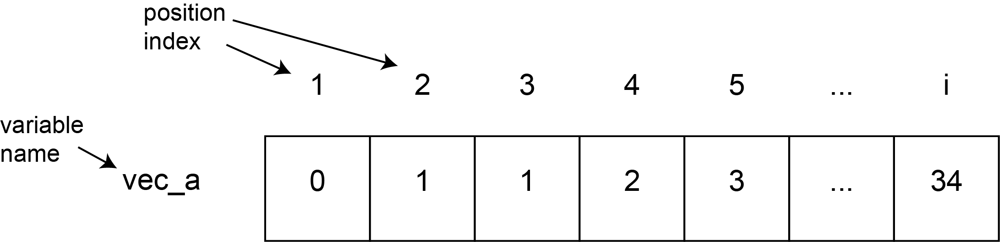

**Solutions to this workshop can be found [here](Solutions_Workshop_4.nb.html)**

# Operations on vectors of numbers

One of the best things about vectors that will come up again and again soon is that you can do operations on them, just like with numbers. Here's one example:
```{r}
# Create a variable holding a vector that contains an evenly spaced sequence of
# five numbers, from 2 to 4

# Add 3 to the vector. What happens?

```


You can also add vectors together!
```{r}
vector_a <- c(1,2,3)
vector_b <- c(4,5,6)

# Add vector_a and vector_b

```


And finally... many math-related functions can work on vectors! `sum()` is a great example of this.
```{r}
# Create a vector of consecutive numbers between 1 and 100

# Use sum() to add up those numbers

```


# Review: vectors, functions, and types

## Vectors and functions
```{r}
# Create a variable, vect_1 that holds a vector containing any 4 numbers

# Calculate the sum of vect_1 and print it out on the screen

# Create a new variable, vect_2, that contains each value of vect_1 squared
# (Don't manually enter the numbers, use vect_1 to calculate this)
```


Notice that lots of functions work on vectors!

## Sequences of numbers
```{r}
# Create a vector of numbers from -5 to 5 containing 21 elements called review_vec

```


# Getting specific elements from vectors

Often, it's really useful to find out what the value of a specific position (or *index*) in a vector is. R makes this easy.
```{r echo=FALSE}
# This just makes sure the graphic is included
if (dir.exists('class_1_figures')){
  library(knitr)
  
}
```


Let's create a really long vector and ask R to tell us about specific points along that vector.
```{r}
# Create three variables, first_num, last_num, and num_of_elements
# The first two can be whatever numbers you want, num_of_elements should be 100
# DON'T use 1 for first_num, and don't use 100 for last_num. Be creative.

# Use the function we learned during the last class to make a sequence of length
# num_of_elements starting at first_num and going to last_num, and put that in a
# vector called new_vector

# Check the length of the vector you just created

```


To access the number at a specific position, we can use square brackets!
```{r}
# Make a vector called long_vector that goes from -1 to 50 and has 100 numbers inside

# Let's check what the first number in long_vector is

# Now check what the 32nd number in long_vector is

```


```{r}
# Now check what the last number in long_vector is
# (bonus: do this using a variable you've already created, rather than just
# typing out 100)

```


You don't have to just provide a single number as in index (the thing inside the square brackets); vectors work too!
```{r}
# Print out the 4th, 5th, 6th, 7th, and 8th number in long_vector

# Now do the same thing as above, but using a function we have learned today to
# specificy the indices (4, 5, 6, 7, 8)

```


Actually, we can get even more creative here. Let's say you wanted to create a vector that had inside it *every other number* from a vector (*i.e.* the 1st, 3rd, 5th, etc numbers that are in that vector). Let's try this.
Hint: you can use `seq()` to create a vector of positions (*indices*) that you then use to get the positions you want from that vector
```{r}
long_vector_2_start <- -1
long_vector_2_end <- 50
long_vector_2_length <- 20
long_vector_2 <-
  seq(long_vector_2_start, long_vector_2_end, length.out = long_vector_2_length)
# Create position_vector, which will hold the positions you want to get out of
# long_vector_2 (i.e. c(1,3,5,....))

# Use long_vector together with position_vector to create shorter_vector, which
# will hold every othern number from long_vector

# print out long_vector_2, then shorter_vector

```

# Data Frames

## What do you do with all of these vectors?

Vectors can be combined to create data frames, or R's word for tables. First, let's make two vectors of equal length:
```{r}
vector1 <- 20:1
vector2 <- seq(4,12,length.out = 20)
length(vector1) == length(vector2)
```

Next, we can use the data.frame() function to combine these vectors into columns:
```{r}
mydataframe <- data.frame(vector1, vector2)

```

To view the top rows of a data frame, use head()
```{r}
head(mydataframe)
```

Some data frames have column **names** and all data frames have row-column **positions**. You can identify a value in a data frame by indicating the position in the column (essentially, the position in the vector) of a row, or by referencing the [row,column] number.

```{r}
mydataframe$vector1[2]
mydataframe[2,1]
mydataframe[1,2]
```

You can also reference each of the rows or columns by leaving the opposite position blank:
```{r}
mydataframe[,1] #column one
mydataframe[2,] #row 2

```


# When we get missing values

A **HUGE** part of analyzing real scientific data is dealing with missing values. There are lots of ways we can get missing values; these are probably the most common:

* When we try to get R to do a nonsensical thing
* When we perform some super taboo math operation
* When we are using real data and we didn't collect every observation (*eg* you measured the height of a bunch of plants every week but by the third week, some of them died)

Every programming language has its own special way of representing 'missing' data; R, ever so special, uses two: *NA* or *NaN*, depending on the situation; don't worry about the difference, I (Eugene) literally learned it while preparing this class, after 5 years of programming in R.

Let's take a look at how these missing values work.

## Performing nonsensical operations

Let's try to see what R does when we ask it to do something that clearly doesn't make sense. Remember that we can ask R to convert a list of characters to numbers. Let's try that again.
```{r}
weird_number_vector <- c('1', '4', 'koala', '18')

# Convert weird_number_vector to numeric type, and print out the result

```


## Taboo math operations

Another way to get missing values is to perform a math operation that R doesn't like. Let's try doing this. Remember that we can perform operations on vectors, e.g. adding two vectors to each other. Let's try dividing vectors this way.
```{r}
vector_1 <- c(1, 2, 0, 3, 0, -5)
vector_2 <- c(0, -3, 1, 6, 0, 0)

# What do you think you'll get if you divide vector_1 by vector_2?

# Try it

```


## Real missing data
Finally, you can enter NA into your vector, just like you would any other value
```{r}
# Create a vector, data_vector, which has some numbers and at least one NA value

# What happens if you take the sum of data_vector?

```


Do you remember how to tell sum() not to use missing values? Check the documentation (using '?') if you've forgotten!
```{r}
# Try using sum() to get the sum of the non-missing values in data_vector

```

# Logicals

## Introduction to logicals

In R, in addition to character and numeric values, we can have logical values. Logical values are `TRUE` and `FALSE`. These words, when you type them, are something like `NA` in that they're special words. 

Logical values are often generated by comparisons between two values. These comparisons are made with logical operators. Many of them you will be familiar with.
```{r Logic}
3 > 4
8 < 5
4 <= 4
```

Note that the logical operator "is equal to" is `==` in R. If you only use `=`, you will reassign your variable (that is `=` in R is the same as `<-`).  
"Not" is specified by `!`. So "is not equal to" is `!=`.

Try to figure out what the output of each of the following lines will be before running them.
```{r}
TRUE == TRUE

TRUE == FALSE

TRUE != FALSE

3 != 4

char = 'a'
char == 'a'

char = 'b'
char == 'a'
```

## Looking for missing values in a vector

One useful function that results in a logical value is `is.na()`
```{r}
# try using is.na() on data_vector (which you created above)

# try using is.na() on position 2 in data_vector

```

Just like you can make a vector of characters or a vector of numeric values, you can also make a vector of logicals.
```{r}
# Make a vector with 3 TRUEs and 2 FALSEs, save it as logical_vec1

# Make a vector called num_vec that starts at 2 and ends at 10 (increasing by 1)

logical_vec2 <- num_vec %% 3 == 2 #what is this line of code doing?
```

## Treating numbers as logicals

In R, FALSE is also encoded as 0, and TRUE is encoded as 1. 
```{r}
0==FALSE
1==TRUE

# How do you think we could easily figure out how many TRUEs there are in logical_vec2?

# How can you get R to tell you the number of missing values in data_vector?

```


## Exercise

Imagine that you're doing an experiment measuring plant height, but some of the plants didn't grow. You decide those should be considered missing values, so they entered `NA` for those plants. Let's count the number of plants that DID grow in your experiment.

```{r}
plant_heights <- c(1.9, 0.1, NA, 0.8, 0.4, 0.2, 7.9, NA, 16.8, 3.5)

# create a logical vector, plant_NA_vector, that contains information on whether
# each value in plant_heights is missing (NA)

# use plant_NA_vector to figure out how many plants total didn't grow
# assign this number to a variable and print it out

# use plant_NA_vector to figure out how many plants DID grow
# assign this number to a variable and print it out

# bonus:figure out what PROPORTION of plants grew
# assign this number to a variable and print it out

```

# Selecting and replacing values from vectors based on logicals

In addition to using indices to get R to tell us a specific position in a vector, we can also use them to replace specific values. Take a look at this example.
```{r}
vector_to_sub <- c(12, 13, 14, 15, NA, 17, 18, 19)

# replace the 2nd value in vector_to_sub with 54
vector_to_sub[2] <- 54
print(vector_to_sub)

# now, try replacing the 1st, 3rd, and 8th values in vector_to_sub with 28,
# using only one line of code (i.e. do it all at once)

```

One really powerful way to use this vector substitution is to combine it with logical vectors. Take a look at the example below:
```{r}
vector_to_sub2 <- 1:3
vector_to_sub2[c(TRUE, FALSE, TRUE)] <- 42

# What do you think vector_to_sub2 looks like now? Print it out to check

```

Try this for yourself. Lots of times, we want to replace missing values in vectors. Let's say that, when you do your analysis on the plant example above, you want to treat the plants that didn't grow as having a height of 0 rather than being missing.
```{r}
# use plant_NA_vector to replace every missing value in plant_heights with a 0

# print the modified plant_heights vector

```

# Operations on logicals (AND, OR)

We can also do "and" (`&`) and "or" (`|`, all the way on the right side of your keyboard). "And" only returns true if both things are true. "Or" returns true if at least one thing is true.

Try predicting what all the operations below will return
```{r}
TRUE & TRUE
TRUE & FALSE
FALSE & FALSE

FALSE | TRUE
TRUE | TRUE
FALSE | FALSE

# bonus: perform some operations on the following variables (unicorns and
# rainbows) that will result in a TRUE value being returned
unicorns <- FALSE
rainbows <- FALSE

```


# Things we hope you've learned today (and will hopefully remember next time)

* Vectors can be subsetted using []
* Missing values can be identified using is.na() or na.rm = TRUE
* Logicals
* Using logicals as indices to pull out or substitute elements of a vector that match some criteria
* Operations that can be performed on logicals (`&` and `|`)
* Data frames can be created using data.frame() and subsetted using []
