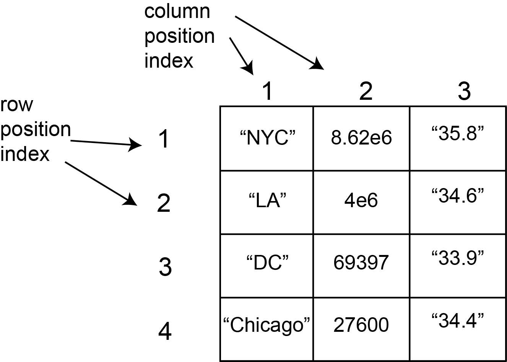

**Solutions to this workshop can be found [here](Solutions_Workshop_6.nb.html)**

# Review


# Dataframes

So far, everything we've been doing in R has involved vectors. However, we haven't yet learned about the most useful data structure in R: data frames.

Data frames are essentially just tables. They have rows and columns, and if you set your data up right, they make it *incredibly* easy to explore your data. R has a ton of operations that are specialized in reading data frames and either plotting them in an easy way, or summarizing the data inside, and we're going to be spending the next couple of days learning about those.

# Reading in tables from excel

A lot of times, it's not really convenient to enter your data in R. When collecting data by hand, it can be really convenient to type it into excel (or google sheets). Although there is a special package in R that can read excel format files (**.xlsx**), this is not commonly used. Instead, we usually save files in **.csv** format, which throws out all of the special formatting excel does and just keeps the data itself.

**csv** stands for *comma-separated values*, and that's just what they are. These files can be easily opened in excel or google sheets, but if you open them in notepad, you can see that they're really just rows of numbers and words separated by... you guessed it, commas.

You should have a dataset in csv format called *penguins.csv*. This is a set of information on measurements collected from birds of 3 penguin species living on 3 different islands. Follow along with this file as we go through the rules. The code below will only work if you have penguins.csv saved in the same folder as this file.

**Note**: these data were collected and made available by Dr. Kristen Gorman and the Palmer Station, Antarctica LTER, a member of the Long Term Ecological Research Network, and put together by Dr. Allison Horst. To read more about the dataset, see Allison Horst's website about it [here](https://github.com/allisonhorst/palmerpenguins).

```{r}
if (dir.exists('class_1_figures')){
  library(knitr)
  include_graphics('class_1_figures/lter_penguins.png')
}
```
Artwork by [\@allison_horst](https://github.com/allisonhorst)

First, let's get R to read in the penguin data.

```{r}
penguin_df <- read.csv('penguins.csv')
View(penguin_df)
```

There are some good practices for how to organize and record your data, and following these will make your life *MUCH* easier when you try to analyze your data. Following these rules means that R will be able to easily read you data, and that the data is immediately set up in such a way that the built-in R functions for processing data can easily work with it.

* Give each column a short, informative title. Avoid spaces and weird symbols/punctuation. You can use letters, numbers, periods, underscores ( _ ) and hyphens. *NEVER* use commas in your data entry.

* You can also name rows, but I suggest avoiding this for now, since you will need to provide a special argument to `read.csv` if you do this.

* Keep a single column as one data type (e.g. a column can contain strings, or numbers, or logicals). R will usually know which is which, and treat the data accordingly.

* Notice that in the penguin dataframe, every row holds a single observation. That is, data on each single data point (penguin) is one row, and each individual piece of information about it is one column (e.g. how long were its flippers? What species did this penguin belong to?)

The last point on this list involves thinking about what constitutes an 'observation' in your data. This can seem subjective! Let's say you're tracking the weight of inidividual penguins over time: is a single observation one penguin, or one timepoint? As you program, you'll start getting an intuitive feeling for better and worse ways to organize data. But remember that data can always be re-organized in R if you don't like how you originally did it (or if someone else collected the data!) These principles of data organization are called *tidy* data, and there is *hugely* useful package, **tidyr** that contains functions to re-organize and tidy up your data. We won't cover it in this class, but I want to share a [link](https://cran.r-project.org/web/packages/tidyr/vignettes/tidy-data.html) with some info in case you continue programming in the future and find that you need it.

**In groups, try the following:**

* Create a new code chunk
* Inside it, read in the data we sent each of you into a dataframe
* What is each observation in your dataframe? What was measured? Tell your group

# Selecting data from data frames: row numbers and column numbers and $

Let's say we wanted to calculate the mean body mass of all the penguins measured in the penguin dataset. How can we do this? We need to select the body mass column. There are a couple of ways to do this. The easiest and most common one is using `$`.

```{r}
# print out all the body masses
print(penguin_df$body_mass_g)
```

We can also use indexing to get a specific row and column position in the data frame. Remember that when we used indexing for vectors, we put the necessary position (or vector of positions) in square brackets after the name of the vector. In a data frame, we need to specify both the row position(s), and the column position(s).

```{r}
if (dir.exists('class_1_figures')){
  library(knitr)
  
}
```

When using indices to specify position in a data frame, **rows first, columns second**

```{r}
# Get the value in the second row and third column in the penguin dataset
print(penguin_df[2, 3])

# Get the values in the 2nd to 5th rows in the fifth column in penguin_df

```

In addition to using numeric indices, you can also use names of columns (or rows, if they're named!)
```{r}
print(penguin_df[2, 'bill_length_mm'])
```

Finally, if you want to get *every* row or *every* column, just leave that index blank.
```{r}
# get every element from 6th column (same as penguin_df$body_mass_g)
print(penguin_df[ , 6])

# get every value in the 6th row of penguin_df

```

Try the following:
```{r}
# Calculate the mean bill length of all penguins in the dataset

# Calculate the standard deviation of bill length for all penguins in the dataset

```

# Creating new columns from operations on other columns

A lot of times, we need to process the data we have in order for it to be interesting to us. You can imagine a scenario in which we'd want to do this in the penguin dataset. We have a list of measures bill depths and lengths from various species, and maybe we want to eventually investigate how these vary across species. But the problem is that even within a species, some bills just happen to be larger, by chance. These would have BOTH higher bill lengths and depths, making our dataset noisier. Maybe what we really care about is the ratio of bill length to depth? R makes calculating this easy.

```{r}
# remember that to specify a column, we can use $. We can also use this to
# create a new column, bill_ratio
penguin_df$bill_ratio <- penguin_df$bill_length_mm/penguin_df$bill_depth_mm

# body mass here is provided in grams
# Create a new column, body_mass_kg, measuring it in kilograms (1 kg = 1000 g)

```

# Creating new data frames from scratch, writing them, and some tricky points (Factors)

Sometimes, you will want to create a brand new data frame from scratch. There are several ways to do this. One way is to create vectors for each column, and then combine them together in a data frame. For example, let's imagine we have investigated the populations of squirrels and pigeons in 4 parks in NYC.

We can make 3 vectors, one with the names of the parks, one with the population of squirrels, and one with the population of pigeons. 
```{r}
park <- c("WashingtonSq", "CentralPark", "ProspectPark", "BatteryPark")
pigeons <- c(8.62e3, 1.5e4, 1939, 276)
rats <- c(1500, 41320, 20003, 4057)
squirrels<- c("358", "546", "439", "344")
```
Then, we can use the function `data.frame()` to turn these into a single data frame. The positions in the vectors will correspond to rows, and the names of the vectors will become the column names.
```{r}
parks_df <- data.frame(park, squirrels, rats, pigeons)
parks_df

# another common way to do the same thing
parks_df_2 <-
  data.frame(
    park = c("WashingtonSq", "CentralPark", "ProspectPark", "BatteryPark"),
    squirrels = c("358", "546", "439", "344"),
    rats = c(1500, 41320, 20003, 4057),
    pigeons = c(8.62e3, 1.5e4, 1939, 276)
    )
parks_df_2
```

```{r}
# try accessing the values rows 1, 2, and 4 of column 1 of parks_df

```

What if you wanted to share this data with a colleague, so they could do their own calculations? The nicest way would be to send them a csv. We can make csvs from data frames in R using `write.csv()`. Take a look at the documentation for this function.

```{r}
# write a csv called 'parks.csv' with the data in parks_df
```

## Watch out for factors!
You may have noticed that accessing the park column gave us something that involved "levels". These are because they're actually not characters, but something called factors. Factors are categorical variables. These are very important for some types of statistical models, but they can be a problem if you are expecting characters or numbers.

Let's look at the `data.frame` again.
```{r}
View(parks_df)
```

Let's try to access the population of squirrels as a number.

```{r}
parks_df$squirrels
as.numeric(parks_df$squirrels)
```

As you can see, the character numbers are being converted not to the numbers they should be, but to their factor levels. I'm sure you can imagine how this could be a huge problem.

When something is a factor and your want it to be a number, do this:

```{r}
as.numeric(as.character(parks_df$squirrels)) 
```

By first going through `as.character` and THEN `as.numeric`, you
preserve your entries as intended.

Finally, if you want to change the values in the data frame, you must remember to reassign that column. We can use the `str()` function to quickly get a preview of all the columns of a dataframe and their type.

```{r}
as.numeric(as.character(parks_df$squirrels)) 
str(parks_df)
parks_df$squirrels <- as.numeric(as.character(parks_df$squirrels)) 
str(parks_df)
```

## Calculate column means, standard deviations, standard errors

Now, maybe we want to use these columns to find out something about parks in NYC. Maybe we want to find the average number of rats and pigeons in NYC parks.

```{r}
# find the mean number of rats and pigeons for parks in NYC
```

If we have many columns with numeric data, finding the mean of each of them individually could take a while. We can use the function `colMeans()` instead. Take a look at the documentation for `colMeans()`

```{r}
# try using colMeans() to find the mean number of rats and pigeons for parks in NYC

# do you run into problems? why? how could we get what we want using this function?
```

# Things we hope you've learned today (and will hopefully remember next time)

* Reading tables from excel into dataframes
* Selecting and creating specific dataframe columns
* Creating new dataframes from scratch
